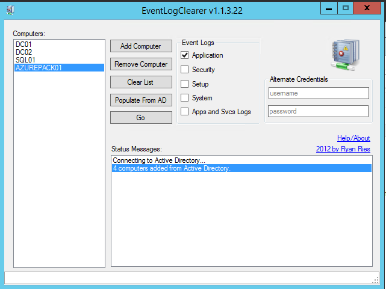
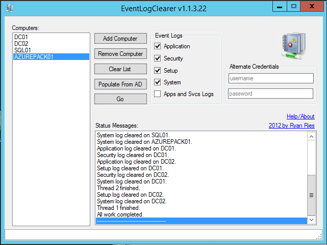

EventLogClearer
===========

This application clears event logs on local and remote computers. You can add the computer names manually, or auto-populate the list of computers from Active Directory. The application uses multiple threads of execution to accomplish the task, which makes it significantly faster when dealing with many networked computers.

